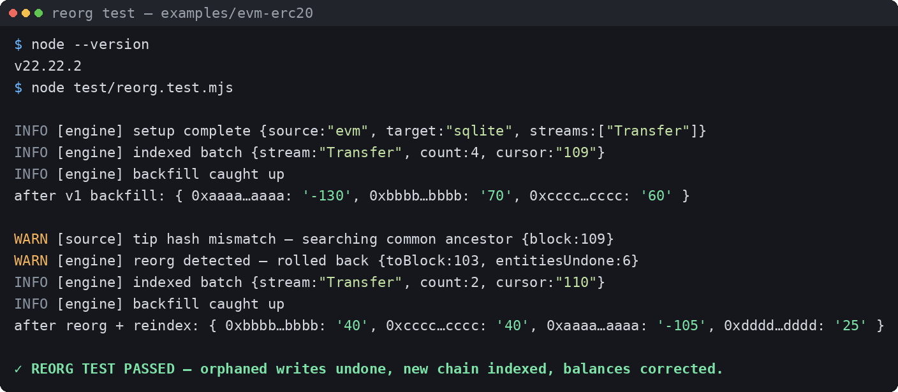
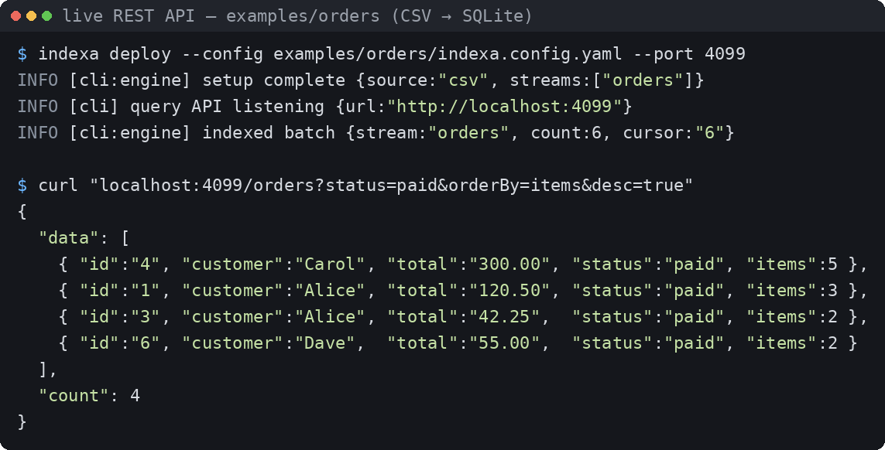

# Indexa

A **declarative database indexer**. You describe *what* to index in one YAML file; Indexa handles the *how* — incremental sync, checkpointing, idempotency, and an auto-generated query API. No engine code to write. Just declare and deploy.

```
declare (yaml + optional handlers)  ->  indexa deploy  ->  REST query API
```

## Why

Writing an indexer by hand means re-solving the same hard problems every time: tracking where you left off, resuming after a crash without double-writing, backfilling history while tailing new data, and exposing a query API. Indexa solves these once. You only describe your data.

## Proof it runs

The reorg test drives the real engine + store + connector against a simulated chain that reorgs at block 108. Indexa detects the changed tip hash, rolls back to the last common ancestor (undoing orphaned writes *and* aggregated balances), and re-indexes the new canonical chain:



The CSV example runs end-to-end with the auto-generated REST API — a live HTTP server answering real queries:



> The reorg test uses a mock JSON-RPC transport (the engine/store/journal/connector code is the real thing — only the RPC source is simulated). Point `rpc:` at a real endpoint and the exact same pipeline indexes a live chain. Reproduce locally with `npm install && npm install ethers && node test/reorg.test.mjs`.

## Install

```bash
npm install        # js-yaml; pg (Postgres) and ethers (EVM) are optional extras
npm link           # optional: makes the `indexa` command global
```

Requires **Node.js >= 22.5** (uses the built-in `node:sqlite`, so the default setup needs zero database installation).

## Quickstart

```bash
indexa init my-app
cd my-app
indexa deploy --config indexa.config.yaml
```

That backfills the sample data into SQLite and starts a REST API at `http://localhost:4000`. Try:

```bash
curl localhost:4000/                       # auto-generated metadata + schema
curl "localhost:4000/orders?status=paid"   # filter
curl "localhost:4000/orders/1"             # get by id
```

## The config file

Everything lives in one file:

```yaml
name: orders-indexer

source:
  type: csv                                  # csv | postgres | <your own>
  sources:
    - { key: orders, file: data/orders.csv }

target:
  type: sqlite                               # sqlite | postgres
  path: ./orders.db

schema:                                      # your output entities
  Order:
    id: ID                                   # every entity needs an id
    customer: String
    total: BigDecimal
    status: String
    items: Int
    created_at: Timestamp
```

Field types: `ID, String, Int, Float, Boolean, BigInt, BigDecimal, JSON, Timestamp`, plus references to other entities. `${ENV_VAR}` and `${ENV_VAR:-default}` interpolation is supported anywhere.

If a stream's raw columns already match an entity (case/plural-insensitive: `orders` -> `Order`), Indexa maps them automatically and **no handler is needed**.

## Handlers (only when you need logic)

Add a `handlers: ./handlers.js` line to the config when raw data needs transforming or aggregating. Handlers are tiny and declarative-ish — they just describe the mapping:

```js
export default {
  async orders(row, ctx) {
    await ctx.store.upsert('Order', row.id, {
      id: row.id, customer: row.customer, total: row.total, status: row.status,
    });

    // Stateful aggregate: read prior entity, then write. Each source row is
    // processed exactly once, so increments are safe.
    const c = await ctx.store.get('Customer', row.customer);
    await ctx.store.upsert('Customer', row.customer, {
      id: row.customer,
      name: row.customer,
      totalSpent: (c ? Number(c.totalSpent) : 0) + Number(row.total),
      orderCount: (c ? Number(c.orderCount) : 0) + 1,
    });
  },
};
```

Run `indexa types --config indexa.config.yaml` to generate `indexa-types.d.ts` for autocomplete on entities and `ctx.store`.

## Auto-generated query API

From your schema, every entity becomes a REST resource — no code:

| Endpoint | Description |
|---|---|
| `GET /` | App metadata + full schema |
| `GET /<entity>` | List with filtering + pagination |
| `GET /<entity>/:id` | Fetch one |
| `GET /_health` | Health check (uptime + per-stream checkpoints) |

### Filtering

Any schema field is a filter. Values are coerced to the field's declared type, so
`?active=true` matches a Boolean and `?items=3` an Int — no manual casting. Add an
operator suffix for anything beyond equality:

| Suffix | Meaning | Example |
|---|---|---|
| *(none)* | equals | `?status=paid` |
| `_ne` | not equal | `?status_ne=refunded` |
| `_gt` `_gte` `_lt` `_lte` | range | `?total_gte=100&total_lt=500` |
| `_in` | one of (comma list) | `?status_in=paid,pending` |
| `_like` | SQL `LIKE` pattern | `?customer_like=Al%` |

`Timestamp` fields sort and range correctly (`?created_at_gte=2026-01-03&created_at_lt=2026-01-05`)
because ISO-8601 is lexicographically ordered.

### Pagination & ordering

`limit` (default 100, max 1000), `offset`, `orderBy=<field>`, `desc=true`. List responses
return `{ data, count, total, limit, offset }` — `count` is the page size, `total` is the
full match count for building pagers. `orderBy` only accepts real schema fields.

### CORS

The read-only query API sends permissive CORS headers by default (and answers `OPTIONS`
preflight). Restrict or disable via config:

```yaml
api:
  cors: false                 # no CORS headers
  # cors: true                # Access-Control-Allow-Origin: * (default)
  # cors: "https://app.example.com"
```

## CLI

```
indexa init [dir]                  scaffold a starter project
indexa deploy --config <file>      backfill + live tail + API
        [--port 4000] [--once] [--no-api]
indexa validate --config <file>    check config without running
indexa types --config <file>       generate TypeScript types
```

`--once` runs a single backfill and stops (good for batch jobs / CI). Without it, Indexa keeps polling the source for new rows (`pollIntervalMs`, default 2000).

## Sources (connectors)

Built-in: **`csv`** (zero-dependency files/exports), **`postgres`** (tails a table by a monotonic cursor column), and **`evm`** (indexes blockchain events with automatic reorg handling — see [`docs/evm-guide.md`](docs/evm-guide.md)).

EVM source example (you only provide an RPC URL — no chain code to write):

```yaml
source:
  type: evm
  rpc: ${RPC_URL}
  confirmations: 12
  contracts:
    - address: "0x..."
      abi: ./erc20.abi.json
      events: [Transfer]
      startBlock: 18000000
```

Postgres source example:

```yaml
source:
  type: postgres
  connection: ${SOURCE_DB_URL}
  tables:
    - { key: orders, table: orders, cursorColumn: updated_at }
```

Write your own connector by implementing `init / streams / close` (see `src/connectors/base.js` and `examples/custom-connector/`), then register it:

```js
import { registerConnector } from 'indexa';
import KafkaConnector from './kafka-connector.js';
registerConnector('kafka', KafkaConnector);
```

A connector exposes ordered **streams** with a monotonic **cursor**; the engine persists the cursor of the last successfully written record *inside the same transaction* as the writes — that is what makes resumption idempotent.

## Targets

`sqlite` (default, built-in) or `postgres` (`target.type: postgres`, `connection: ${DB_URL}`, requires `npm install pg`). Tables are created automatically from your schema.

## Deploy with Docker

```bash
# put your config + handlers + data under ./app, then:
docker build -t my-indexer .
docker run -p 4000:4000 -e CONFIG=app/indexa.config.yaml my-indexer
```

The image has a healthcheck on `/_health` and respects `INDEXA_LOG_LEVEL`
(`debug|info|warn|error`) and `INDEXA_LOG_FORMAT` (`text|json` — set `json` for
structured logs that ship cleanly into a log aggregator).

## How it works

```
 source connector ──stream(cursor)──► engine ──transaction──► target store ──► REST API
                                         │                        ▲
                                         └─ checkpoint persisted ─┘ (same txn = idempotent)
```

1. **Backfill** — drain each stream from its last checkpoint until caught up.
2. **Live tail** — poll for records after the cursor on an interval.
3. **Idempotency** — entity writes + checkpoint advance commit together; a crash never double-writes or skips.

## Reorg handling (blockchain)

The `evm` connector handles chain reorganizations automatically. Every entity write
made while indexing an unfinalized block is recorded in an **undo journal**. When the
connector detects that a previously-indexed block hash changed, the engine rolls the
affected entities back to the last common ancestor — *including aggregated values like
running balances* — and then re-indexes the new canonical chain. See
[`docs/evm-guide.md`](docs/evm-guide.md) and the proof in `test/reorg.test.mjs`.

## Not yet included (extension points)

- **GraphQL** — the REST layer is schema-derived; a GraphQL resolver set can be generated from the same schema.
- **Parallel backfill** — backfill is currently sequential per stream; partition by cursor range for speed.
- **WebSocket/Firehose ingestion** — the `evm` connector polls; a push-based transport (Substreams/Firehose) can be added as a connector for higher throughput.

These are deliberately left out to keep the core small and the "just deploy" promise intact.

## Testing

```bash
npm test           # runs the full node:test suite (node --test)
```

The suite covers schema/type coercion, config validation, the CSV parser, the store
(filters, comparison operators, pagination, the injection guard, journal rollback), the
REST API over a live server, and the engine's checkpointing/idempotency. The EVM reorg
proof (`test/reorg.test.mjs`) runs when the optional `ethers` package is installed and
skips cleanly otherwise. CI runs everything on Node 22 and 24.

## Contributing

See [CONTRIBUTING.md](CONTRIBUTING.md). In short: `npm install`, `npm test`, keep the core
dependency-light, and add a test alongside any behaviour change.

## License

[MIT](LICENSE) © IndexaDB
